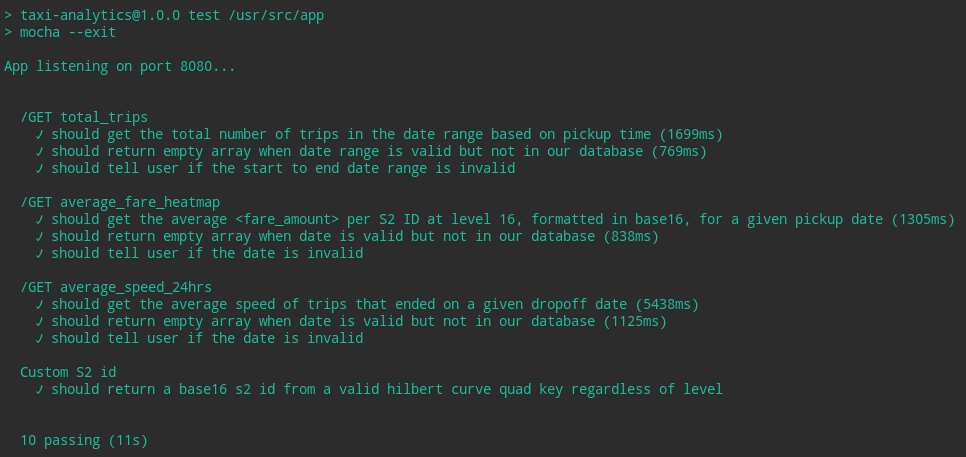

# Taxi Analytics app
Please refer to [designconsiderations.md](designconsiderations.md) for the thought process through designing this application.

This application is written in nodejs and `install.sh` requires **docker** to be installed. However, if you don't have docker, you can just run:

```
npm install
npm start
```

I did not use any composer with the dockerfile so that it can be run with minimal requirements.

## Running tests
To run the tests through the docker container, first stop the container by running:

>`docker stop dennis-taxi-analytics`

then run the following command for the test:

>`docker run -e CI=true --rm taxi-analytics npm run test`

You can then resume the application by running:

>`docker start dennis-taxi-analytics`

If you manually installed the application via `npm install`, run the following instead:

>`npm test`


## Uninstalling
The docker container is set to be persistent and ran with `'restart=always'`. To remove it:

```
docker stop dennis-taxi-analytics
docker rm dennis-taxi-analytics
docker rmi taxi-analytics
```